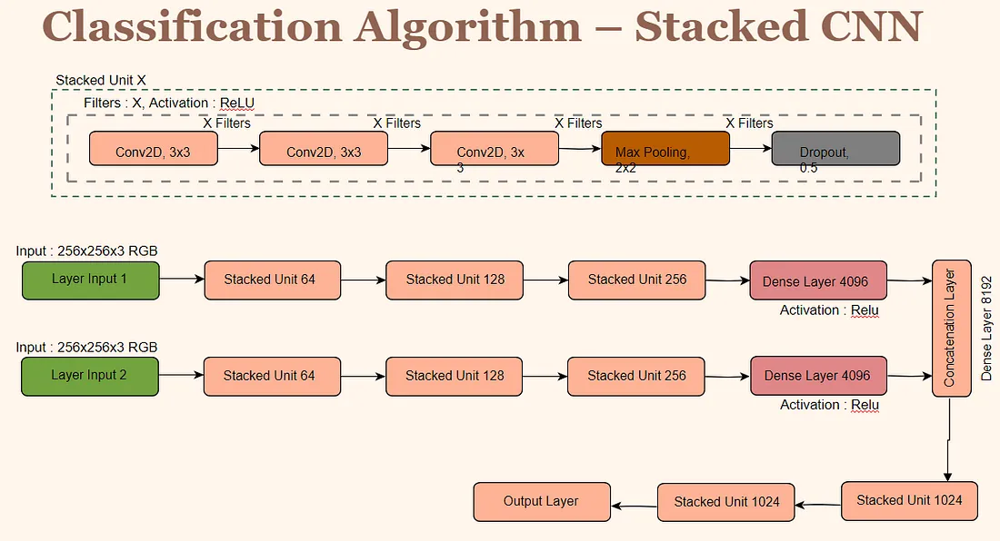

# Advanced-Machine-Learning-Project

Project by Nishant Kushwaha, Spandan Pal, David Gong, Sharan Arora and Mansi Sharma​​

## Introduction
The focal point of our project is the meticulous identification of hotels where victims of human trafficking are photographed, an intricate task compounded by the challenge posed by subpar image quality and atypical camera angles. Our team is dedicated to employing advanced image analysis methodologies to discern recurrent patterns within images of hotel rooms. This analytical pursuit is designed to offer invaluable assistance to investigators grappling with human trafficking cases.

To achieve this goal, we utilize a multifaceted approach integrating a variety of tools and techniques. Our data foundation is drawn from Kaggle, specifically sourced from TraffickCam, providing a substantial repository for our analysis. In the technical implementation, Python plays a pivotal role, facilitating image resizing and masking procedures essential for enhancing image clarity and isolating relevant features. Furthermore, our methodology employs sophisticated classification algorithms, notably stacked Convolutional Neural Networks (CNNs), known for their efficacy in pattern recognition tasks, to decipher and categorize image content accurately.

By amalgamating these tools and methodologies, we aim to create a comprehensive framework that enhances the capacity of law enforcement and anti-trafficking entities to identify potential locations associated with human trafficking activities, thereby contributing significantly to the fight against this heinous crime.

## Background
Identifying the hotels depicted in photographs plays a pivotal role in human trafficking investigations, as it enables the tracking and intervention necessary to combat these illicit activities effectively. However, a significant challenge arises from the submission of numerous images to law enforcement agencies, many of which suffer from poor quality and unfavorable angles. This limitation severely hampers investigators’ ability to pinpoint the hotels associated with trafficking, thereby endangering more lives.

Our project introduces a groundbreaking approach by leveraging image processing and machine learning methodologies in a crucial realm of law enforcement. By addressing this challenge, we aim to significantly enhance the prospects for advancements in human trafficking investigations.

## Data Description
Containing 100,000 images sourced from more than 3,100 hotels situated in prominent metropolitan regions across the United States, this dataset presents a wide-ranging and diverse collection of visual data. Acquired via a mobile application crafted by the Exchange Initiative in 2015, this dataset underscores the significance of community involvement in combating human trafficking.

Accessing this expansive dataset was made possible through Kaggle, where it was made available for a competition. The dataset, originating from the TraffickCam mobile app, exemplifies a crowdsourced initiative. It serves as an input to a phone application designed to aid law enforcement in locating victims and prosecuting individuals involved in trafficking activities.

## Our Approach

## Image Processing 

Image Resizing & Masking : The team undertook the standardization of image resolution to 256x256 pixels, a strategic move aimed at overcoming the obstacle posed by disparate image sizes. This standardization holds pivotal importance in ensuring uniformity during image processing and the subsequent training phases of the machine learning model. To augment the dataset, an additional approach involved the generation of supplementary data through image masking. This involved the application of a “mask” to images extracted from the dataset, selectively covering specific areas of the image to create variations and expand the dataset.

Filling the Masks : Upon creating the masks, there arose a necessity to address the void left within the masked portions of the images due to information loss. It’s crucial to highlight that simply using content generated from stable diffusion to fill these masks would not serve our purpose, as our focus lies in capturing the unique features specific to each hotel for classification. Hence, utilizing the remaining parts of the image became imperative to fill the masks adequately.
Subsequently, we implemented horizontal and vertical flips on the images, resulting in the generation of numerous filled images. Our dataset comprised 3,116 hotels, each with approximately 20 classes, and an additional 4,950 mask images available for masking. When multiplied together, this equated to a staggering potential of approximately 308.5 million new images that could be utilized for our training algorithm. However, the generation time for a single image amounted to approximately 8 seconds, rendering the creation of all 308.5 million images an unfeasible endeavor within a reasonable timeframe.

To conduct a proof of concept, a decision was made to proceed with a binary classification approach using data sampling. This involved randomly selecting 2 out of the 20 available classes to focus on. Employing a resize algorithm across the selected masks and images enabled us to explore all potential combinations of masks and images. Yet, even with this narrowed scope, generating the images alone would have taken approximately 19 days. To address this challenge, a strategy was devised to randomly select 20,000 images from all the available masks. An algorithm was designed to distribute the workload among team members, allowing each individual to run the program on their respective computers. This approach facilitated the processing of images in parallel, enabling team members to pause and resume the program as needed. Ultimately, we divided the data into train-test sets with an 80:20 ratio and train-validation sets with an 85:15 split for further analysis.

## Classification Algorithm
## Stacked CNNs

During the image generation phase, where two images were produced from a single masked image via vertical and horizontal flips, our approach involved utilizing both images independently for classification purposes. To accomplish this, a stacked Convolutional Neural Network (CNN) was devised, designed to process the images in two distinct channels: one from the vertical flip and the other from the horizontal flip.

The selection of a Stacked CNN stemmed from its recognized efficiency in handling image classification tasks. CNNs excel in capturing spatial hierarchies within images, making them a fitting choice for this particular project. Stacking these CNNs offers the advantage of effectively capturing spatial hierarchies in images while reducing variance. They possess the capacity to discern diverse image features, ranging from fundamental edges and textures in the initial layers to more intricate patterns and components of objects in deeper layers. This capability is pivotal for our project’s objectives, given its focus on identifying specific features and patterns within hotel room images, crucial for distinguishing one hotel from another.

Although the ensemble model exhibited extended processing durations, its notable advantage lay in achieving reduced variance. In scenarios where classification involves numerous distinct classes, a lower variance is typically favored. Nonetheless, due to time constraints, we found it necessary to transition to a single-layer CNN, as elaborated below.

## Deep CNN

Next, for the implementation using a Deep CNN using a single channel, we used a single blended image as input for image classification. This input image was created by blending the vertical flip with the horizontal flip image.

The Deep network is able to automatically learn hierarchical representations of the features from the input data. Each layer extracts increasingly abstract and complex features, allowing the model to capture intricate patterns and relationships. Moreover, the depth of the network makes the it beneficial for the image classification task as the relationship between pixels can be intricate. Again, leveraging convolution layers here makes it capable to learning translation-invariant features.

## Result
## Key Findings and Accuracy Metrics

Our Convolutional Neural Network models excelled in accurately determining hotel identities from a variety of image inputs. They adeptly navigated through the challenges posed by different image qualities and camera angles, effectively identifying unique hotel characteristics. This resulted in a notably high success rate in correct hotel identifications. We had an accuracy high of 96 percent.

For this plot, you can see that the validation and training accuracy both increase with the number of epochs. The validation accuracy starts to decrease after the 6th epoch however, while the training accuracy continues to increase.

This plot shows that the test accuracy was .96, which is extremely high. This means it is very close to being an universal approximator. The accuracy we achieved was achieved using only around 10 percent of our available data, which means there is high potential to expand to other classes.

This confusion matrix shows that class 1 has an accuracy of 100 percent. There are a few misclassifications with class 0 of around 154. Using more data or slightly tweaking the CNN can solve this problem.

# Conclusion

Our project effectively applies machine learning to a significant social issue, achieving accurate hotel identification in trafficking cases by overcoming image processing challenges. Leveraging our current model can help identify hotels and be leveraged in other possible use cases.

## Next Steps

We could expand the dataset to include more classes and improve the accuracy. Additionally, we could also refine the CNN with different hyperparameters or training techniques such as deeper networks as well as implement parallel processing to reduce the time to complete the training.

A real time application can be developed to quickly analyze any images inputted and quickly find the hotel. Next steps could be to explore the integration of semantic segmentation through the U-Net architecture, which is ideally suited for managing the extensive collection of images in our dataset. This technique will enable a more detailed and nuanced analysis of the image contents, allowing our algorithms to accurately differentiate and classify various elements within each photograph, including furniture, fixtures, and the general layout of rooms. This enhanced level of image interpretation is crucial for improving the precision of our hotel identification process.

We could also go into the realm of stable diffusion fine-tuning. By utilizing our comprehensive set of masked images, our objective is to enhance pre-trained latent stable diffusion models. This refinement is expected to empower these models to proficiently restore the obscured or blurred sections of images, an aspect that is vital when crucial details are indistinct or missing. This technique promises to be immensely beneficial in investigations by reviving and clarifying vital visual data.

Lastly, we are contemplating the utilization of AI for image upscaling. Given that our dataset comprises images of 2K/4K resolution, training a network to upscale images of lower resolution to these higher standards could dramatically decrease the computational effort needed for processing high-resolution images. This advancement would not only boost the operational efficiency of our image analysis pipeline but also elevate the quality of the images under scrutiny, thereby supporting the more accurate identification of hotel environments and related settings.

## References
https://www.kaggle.com/competitions/hotel-id-to-combat-human-trafficking-2022-fgvc9/overview
https://www.jeremyong.com/color%20theory/2022/02/19/implementing-the-flip-algorithm/
https://pillow.readthedocs.io/en/stable/
https://www.tensorflow.org/

## Related Work
This was a Kaggle competition so there are other projects and ideas around this topic. Our group did not use any of them and came up with our own approach to solve this issue.
